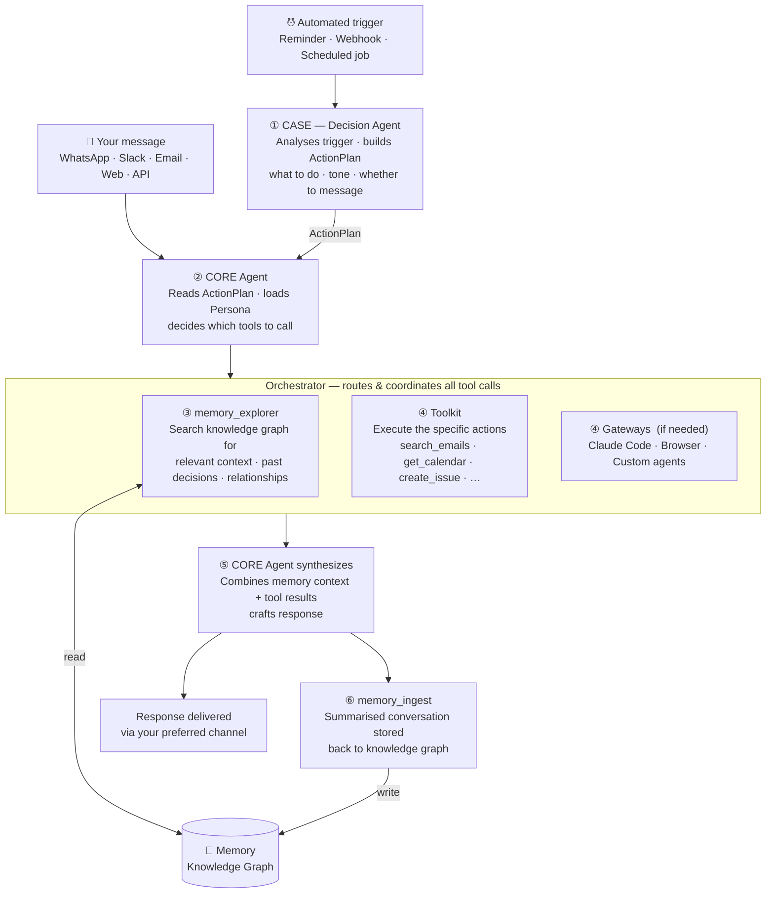
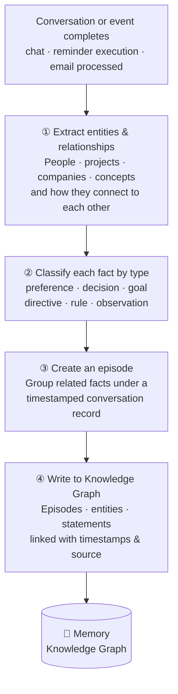
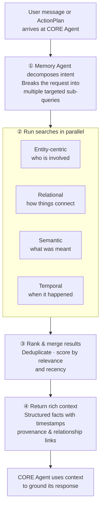

<div align="right">
  <details>
    <summary >🌐 Language</summary>
    <div>
      <div align="center">
        <a href="https://openaitx.github.io/view.html?user=RedPlanetHQ&project=core&lang=en">English</a>
        | <a href="https://openaitx.github.io/view.html?user=RedPlanetHQ&project=core&lang=zh-CN">简体中文</a>
        | <a href="https://openaitx.github.io/view.html?user=RedPlanetHQ&project=core&lang=zh-TW">繁體中文</a>
        | <a href="https://openaitx.github.io/view.html?user=RedPlanetHQ&project=core&lang=ja">日本語</a>
        | <a href="https://openaitx.github.io/view.html?user=RedPlanetHQ&project=core&lang=ko">한국어</a>
        | <a href="https://openaitx.github.io/view.html?user=RedPlanetHQ&project=core&lang=hi">हिन्दी</a>
        | <a href="https://openaitx.github.io/view.html?user=RedPlanetHQ&project=core&lang=th">ไทย</a>
        | <a href="https://openaitx.github.io/view.html?user=RedPlanetHQ&project=core&lang=fr">Français</a>
        | <a href="https://openaitx.github.io/view.html?user=RedPlanetHQ&project=core&lang=de">Deutsch</a>
        | <a href="https://openaitx.github.io/view.html?user=RedPlanetHQ&project=core&lang=es">Español</a>
        | <a href="https://openaitx.github.io/view.html?user=RedPlanetHQ&project=core&lang=it">Italiano</a>
        | <a href="https://openaitx.github.io/view.html?user=RedPlanetHQ&project=core&lang=ru">Русский</a>
        | <a href="https://openaitx.github.io/view.html?user=RedPlanetHQ&project=core&lang=pt">Português</a>
        | <a href="https://openaitx.github.io/view.html?user=RedPlanetHQ&project=core&lang=nl">Nederlands</a>
        | <a href="https://openaitx.github.io/view.html?user=RedPlanetHQ&project=core&lang=pl">Polski</a>
        | <a href="https://openaitx.github.io/view.html?user=RedPlanetHQ&project=core&lang=ar">العربية</a>
        | <a href="https://openaitx.github.io/view.html?user=RedPlanetHQ&project=core&lang=fa">فارسی</a>
        | <a href="https://openaitx.github.io/view.html?user=RedPlanetHQ&project=core&lang=tr">Türkçe</a>
        | <a href="https://openaitx.github.io/view.html?user=RedPlanetHQ&project=core&lang=vi">Tiếng Việt</a>
        | <a href="https://openaitx.github.io/view.html?user=RedPlanetHQ&project=core&lang=id">Bahasa Indonesia</a>
      </div>
    </div>
  </details>
</div>

<div align="center">
  <a href="https://getcore.me">
    
  </a>

## CORE: Your Personal AI Assistant

*Open source. Self-hostable. Acts before you ask.*

<p align="center">
    <a href="https://railway.com/deploy/core">
        
    </a>
</p>
<p align="center">
    <a href="https://getcore.me">
        
    </a>
    <a href="https://docs.getcore.me">
        
    </a>
    <a href="https://discord.gg/YGUZcvDjUa">
        
    </a>
</p>
</div>

---

Your agent can take actions in any app. You can talk to it from WhatsApp or Slack. You can give it skills and schedule automations.

**CORE does all of that. And then it goes further.**

The moment you stop talking to it — it keeps working. Built for developers who want their AI to move without being pushed.

---

> **[Demo GIF — Sentry alert fires → CORE creates GitHub issue → assigns engineer → posts Slack summary. No user prompt.]**

---

## What's different

**Proactiveness** — CORE connects to your tools via webhooks and polling. When something happens — a Sentry alert, a Slack message, a calendar change — CORE evaluates it against what it knows about you and decides whether to act, notify, or ignore. You don't ask. It acts. [How triggers work →](https://docs.getcore.me/concepts/meta-agent)

**Temporal Memory** — Not a chat history. Not a vector DB. A knowledge graph where every fact about you — preferences, decisions, relationships, goals — is classified and connected over time. CORE knows context, not just commands. [How memory works →](https://docs.getcore.me/concepts/memory/overview)

---

## Quickstart

### Self-Host

**Requirements:** Docker 20.10+, Docker Compose 2.20+, 4 vCPU / 8GB RAM

```bash
git clone https://github.com/RedPlanetHQ/core.git
cd core/hosting/docker
cp .env.example .env
docker compose up -d
```

Open `http://localhost:3000` → connect your first app → hand off your first task.

**Pick your model** (edit `.env`):

```bash
OPENAI_API_KEY=sk-...                    # OpenAI
ANTHROPIC_API_KEY=sk-ant-...             # Anthropic Claude
OLLAMA_URL=http://localhost:11434        # Ollama — fully local, no cloud
OPENAI_BASE_URL=https://your-proxy.com  # Any OpenAI-compatible endpoint
```

[Full self-hosting guide →](https://docs.getcore.me/self-hosting/docker)

> ☁️ Prefer cloud? CORE cloud is currently in waitlist. [Join →](https://app.getcore.me)

---

## How it works

Two paths into CORE — messages from you, and triggers that fire automatically. Both converge on the same intelligence.



### How New Memory Is Stored

Every conversation is processed into structured facts — not saved as raw text.



### How Relevant Info Is Searched

Retrieval is intent-driven — not keyword matching.



**What gets stored:** preferences, decisions, goals, directives, relationships between people and topics — not just facts but the *when* and *why* behind them.

---

## Key systems

**[Memory](https://docs.getcore.me/concepts/memory/overview)** — Temporal knowledge graph (Neo4j). Classifies every fact — preference, decision, directive, relationship — and connects it over time. Retrieval is intent-driven, not keyword-based.

**[Toolkit](https://docs.getcore.me/concepts/toolkit)** — Unified MCP actions layer. Connect your apps once; CORE and every agent you connect gets 1000+ actions/tools through a single endpoint.

**[CORE Agent](https://docs.getcore.me/concepts/meta-agent)** — The orchestrator. Evaluates incoming triggers against memory, picks tools, coordinates multi-step workflows, and spawns sub-agents.

**[Gateway](https://docs.getcore.me/access-core/overview)** — The channel layer. WhatsApp, Telegram, Slack, email, web dashboard, API — same memory and context everywhere. Supports voice notes, images, and documents.

**[Skills & Automations](https://docs.getcore.me/toolkit/overview)** — Skills and automations. Trigger on a schedule or on events. Morning briefs, Sentry watchers, weekly digests — CORE evaluates each against your memory before acting.

---

## Security

CASA Tier 2 Certified · TLS 1.3 in transit · AES-256 at rest · Data never used for model training · Self-host for full isolation

[Security Policy →](SECURITY.md) · Vulnerabilities: harshith@poozle.dev

---

## Community

- [Discord](https://discord.gg/YGUZcvDjUa) — questions, ideas, #contributing
- [CONTRIBUTING.md](CONTRIBUTING.md) — how to set up and send a PR
- [`good-first-issue`](https://github.com/RedPlanetHQ/core/labels/good-first-issue) — start here
- [Changelog](https://docs.getcore.me/opensource/changelog) — what's shipped

<a href="https://github.com/RedPlanetHQ/core/graphs/contributors">
  
</a>
