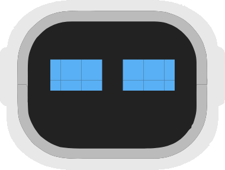
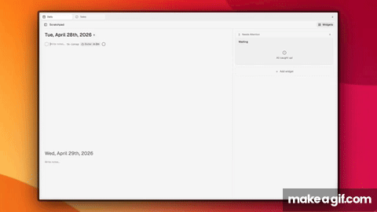
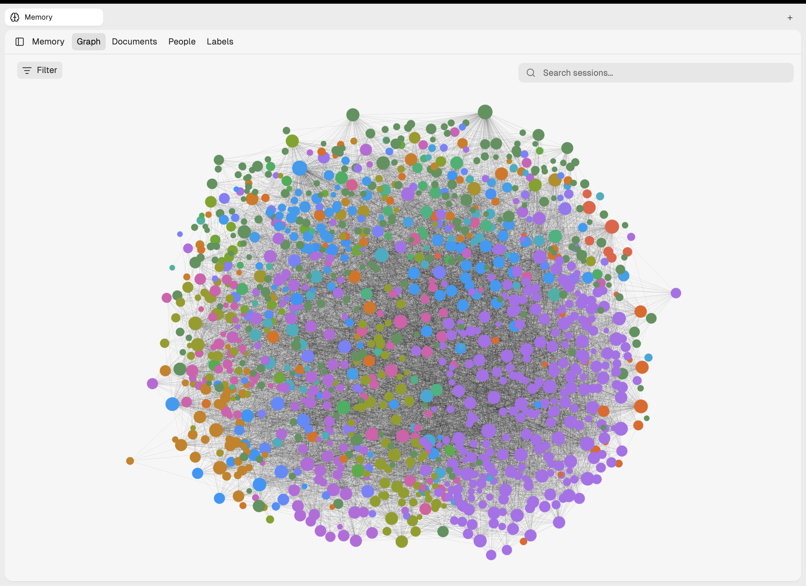
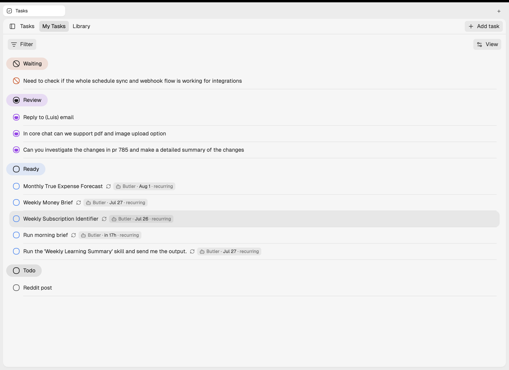
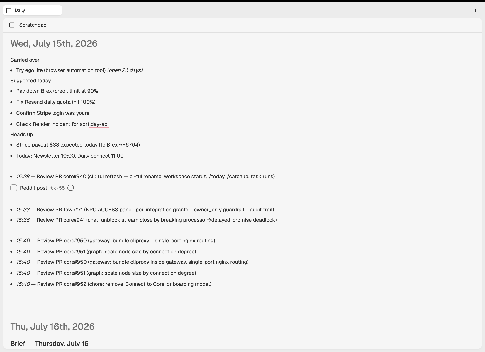
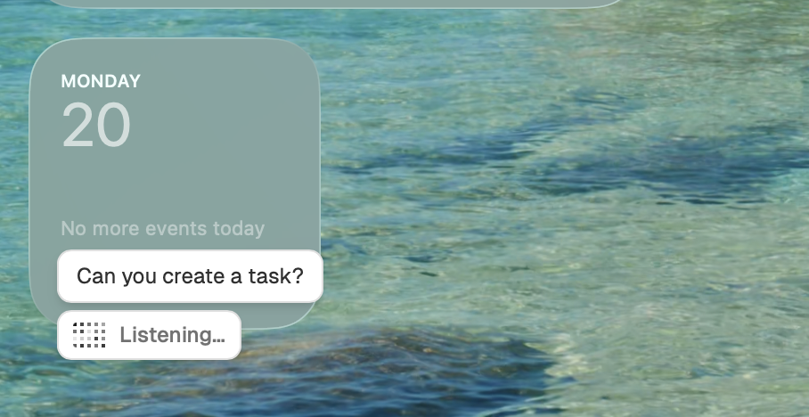
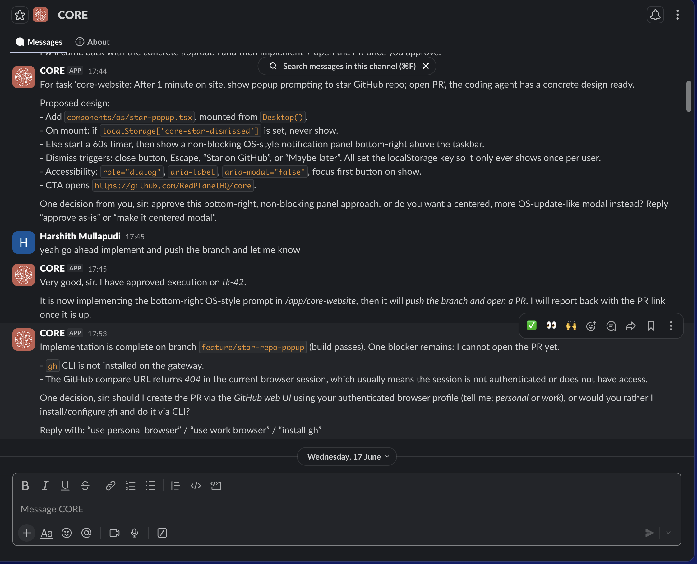
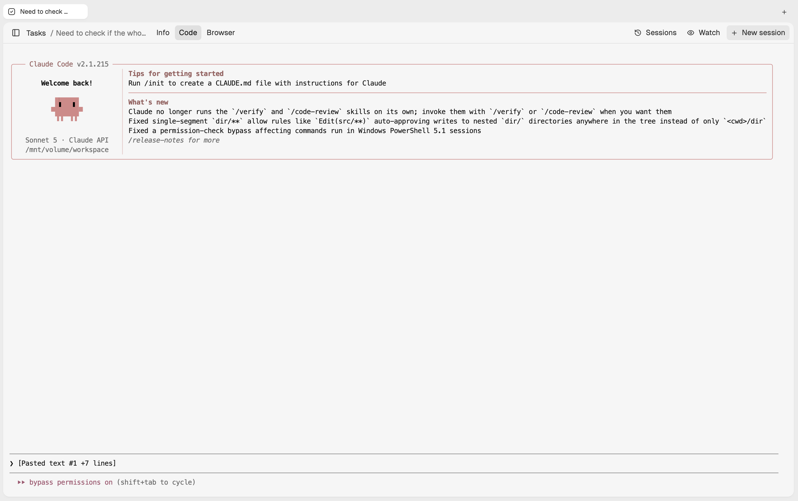
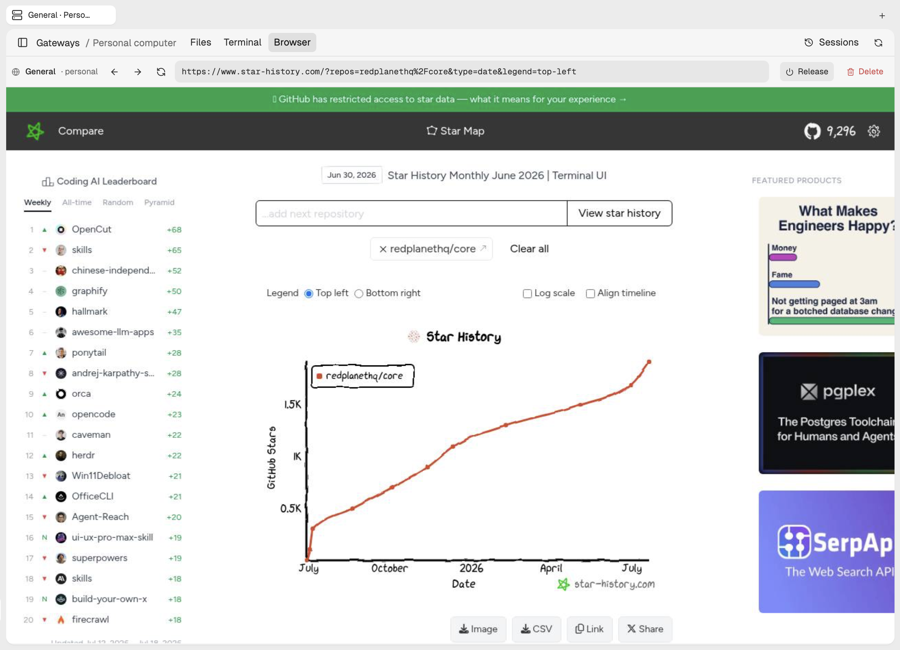
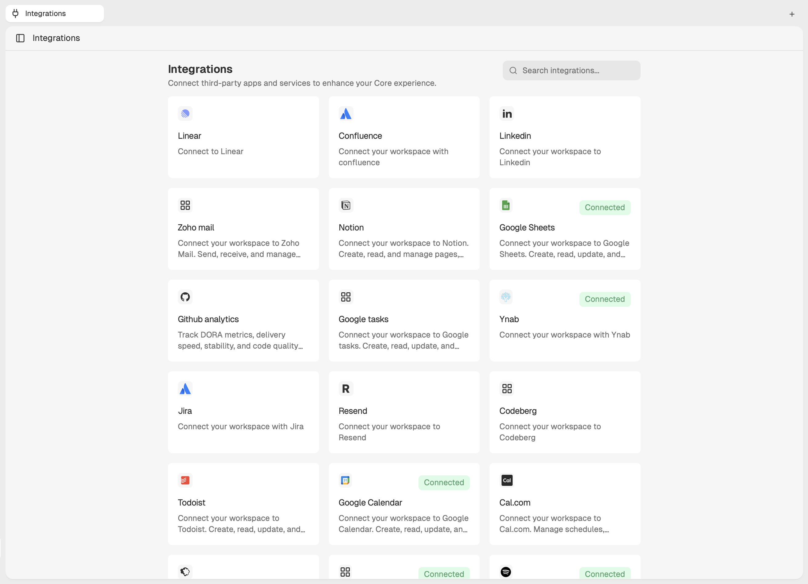

<div align="right">
  <details>
    <summary >🌐 Language</summary>
    <div>
      <div align="center">
        <a href="https://openaitx.github.io/view.html?user=RedPlanetHQ&project=core&lang=en">English</a>
        | <a href="https://openaitx.github.io/view.html?user=RedPlanetHQ&project=core&lang=zh-CN">简体中文</a>
        | <a href="https://openaitx.github.io/view.html?user=RedPlanetHQ&project=core&lang=zh-TW">繁體中文</a>
        | <a href="https://openaitx.github.io/view.html?user=RedPlanetHQ&project=core&lang=ja">日本語</a>
        | <a href="https://openaitx.github.io/view.html?user=RedPlanetHQ&project=core&lang=ko">한국어</a>
        | <a href="https://openaitx.github.io/view.html?user=RedPlanetHQ&project=core&lang=hi">हिन्दी</a>
        | <a href="https://openaitx.github.io/view.html?user=RedPlanetHQ&project=core&lang=th">ไทย</a>
        | <a href="https://openaitx.github.io/view.html?user=RedPlanetHQ&project=core&lang=fr">Français</a>
        | <a href="https://openaitx.github.io/view.html?user=RedPlanetHQ&project=core&lang=de">Deutsch</a>
        | <a href="https://openaitx.github.io/view.html?user=RedPlanetHQ&project=core&lang=es">Español</a>
        | <a href="https://openaitx.github.io/view.html?user=RedPlanetHQ&project=core&lang=it">Italiano</a>
        | <a href="https://openaitx.github.io/view.html?user=RedPlanetHQ&project=core&lang=ru">Русский</a>
        | <a href="https://openaitx.github.io/view.html?user=RedPlanetHQ&project=core&lang=pt">Português</a>
        | <a href="https://openaitx.github.io/view.html?user=RedPlanetHQ&project=core&lang=nl">Nederlands</a>
        | <a href="https://openaitx.github.io/view.html?user=RedPlanetHQ&project=core&lang=pl">Polski</a>
        | <a href="https://openaitx.github.io/view.html?user=RedPlanetHQ&project=core&lang=ar">العربية</a>
        | <a href="https://openaitx.github.io/view.html?user=RedPlanetHQ&project=core&lang=fa">فارسی</a>
        | <a href="https://openaitx.github.io/view.html?user=RedPlanetHQ&project=core&lang=tr">Türkçe</a>
        | <a href="https://openaitx.github.io/view.html?user=RedPlanetHQ&project=core&lang=vi">Tiếng Việt</a>
        | <a href="https://openaitx.github.io/view.html?user=RedPlanetHQ&project=core&lang=id">Bahasa Indonesia</a>
      </div>
    </div>
  </details>
</div>

<div align="center">
  <a href="https://getcore.me">
    
  </a>


# Your Personal AI OS

Not a chatbot you open. An AI that is always on, always watching.
Name it. Shape it. Connect it to everything you use. Reach it however you work.
Open source, self-hosted, yours forever.

<p align="center">
    <a href="https://getcore.me">
        
    </a>
    <a href="https://docs.getcore.me">
        
    </a>
    <a href="https://discord.gg/YGUZcvDjUa">
        
    </a>
    <a href="https://github.com/RedPlanetHQ/core/blob/main/LICENSE">
        
    </a>
    <a href="https://github.com/RedPlanetHQ/core/stargazers">
        
    </a>
</p>
</div>

---

## See it work

Watch CORE take a plain-text task, gather context from GitHub and memory, plan the work, run a Claude Code session, and open a PR:

<p align="center">
  <a href="https://www.youtube.com/watch?v=7y_kt_UTYQs">
    
  </a>
</p>

---

## Overview

<table>
<tr>
<td width="40%" valign="middle">
<h3>Memory</h3>
CORE indexes email, meetings, GitHub, Linear, Slack and every assistant conversation into a temporal knowledge graph. Every task starts with the full picture — preferences, decisions, and prior context already loaded.
</td>
<td width="60%">

</td>
</tr>
<tr>
<td width="40%" valign="middle">
<h3>Tasks</h3>
Every unit of work is a task with your spec, CORE's plan, live state, and a dedicated chat thread. One-shot or recurring. Each task can spawn a coding session, drive the browser, or run terminal commands.
</td>
<td width="60%">

</td>
</tr>
<tr>
<td width="40%" valign="middle">
<h3>Scratchpad</h3>
Your daily page. Write <code>[ ] Fix the auth bug from issue #47</code> and CORE picks it up within 3 minutes, loads context from your repo and memory, and drafts a plan.
</td>
<td width="60%">

</td>
</tr>
<tr>
<td width="40%" valign="middle">
<h3>Voice</h3>
Press Ctrl+Option on Mac and speak. CORE runs the task in the background without breaking your flow — no window to open, no context switch.
</td>
<td width="60%">

</td>
</tr>
<tr>
<td width="40%" valign="middle">
<h3>Messaging</h3>
Reach CORE from WhatsApp, Slack, or Telegram. Send a task from the airport or from bed — CORE has the same memory and context regardless of where the message comes from.
</td>
<td width="60%">

</td>
</tr>
<tr>
<td width="40%" valign="middle">
<h3>Coding agents</h3>
CORE spins up Claude Code or Codex sessions with the full task context, runs them on your machine or in Docker/Railway, and opens a PR when done. Sessions keep running when your laptop is closed. Point CORE at your existing Claude or Codex subscription — the whole stack runs on it, <a href="https://docs.getcore.me/gateway/subscription-proxy">no separate API key needed</a>.
</td>
<td width="60%">

</td>
</tr>
<tr>
<td width="40%" valign="middle">
<h3>Browser</h3>
A built-in browser CORE can drive on your behalf. Because it's isolated from your main browser, you log in only to the accounts you want the assistant to access.
</td>
<td width="60%">

</td>
</tr>
<tr>
<td width="40%" valign="middle">
<h3>Integrations</h3>
One-click integrations to 50+ apps via MCP — GitHub, Linear, Jira, Slack, Gmail, Calendar, Sentry, Notion, Todoist. Webhook triggers turn inbound events into proactive work.
</td>
<td width="60%">

</td>
</tr>

</table>

---

## How CORE compares

| | CORE | OpenClaw | Hermes Agent | Devin / Copilot |
|---|:---:|:---:|:---:|:---:|
| Multiple interfaces (voice, scratchpad, chat, messaging) | ✅ | Partial | ❌ | ❌ |
| Persistent memory across tasks | ✅ | ❌ | ✅ | ❌ |
| Delegates to coding agents (Claude Code, Codex) | ✅ | ❌ | ❌ | ✅ |
| Structured task planning with human approval | ✅ | ❌ | ❌ | Partial |
| Custom name, personality, and voice | ✅ | ❌ | ❌ | ❌ |
| 50+ app connectors | ✅ | Partial | Partial | ❌ |
| Terminal and browser access via gateway | ✅ | ✅ | ✅ | ✅ |
| Human-in-loop by default | ✅ | ❌ | ❌ | ❌ |
| Open source and self-hostable | ✅ | ✅ | ✅ | ❌ |

---

## Run CORE on your Claude or Codex subscription

CORE can point at your existing Claude Pro or Codex subscription instead of API keys. Memory, planning, task execution, and coding sessions all run on the subscription you already pay for — no per-token bill on top.

[Set up the subscription proxy →](https://docs.getcore.me/gateway/subscription-proxy)

---

## Quickstart

Open source and self-hosted. Your data stays in your infrastructure.

**Choose your path:**

| I want to... | How |
|---|---|
| Try it on my machine | Run the one-step install below (requires Docker) |
| Deploy on a server or VPS | One-click Railway deploy |
| Use the Mac app | [Join the waitlist](https://www.getcore.me/) |

**Install and start CORE:**

```bash
npm install -g @redplanethq/corebrain && corebrain setup
```

The setup wizard asks for an install directory, AI provider, API key, and chat model. It generates secrets, starts the stack, and opens `http://localhost:3033`.

Most local installs take a few minutes once Docker is running.

**Or deploy on Railway:**

[](https://railway.com/deploy/core)

**Connect a gateway** so CORE can run coding agents, drive your browser, and access local folders:

```bash
corebrain login
corebrain gateway setup
```

**Requirements:** Docker 20.10+, Docker Compose 2.20+, 4 vCPU / 8GB RAM

[Full self-hosting guide](https://docs.getcore.me/self-hosting/setup)

**Your first task (2 minutes after setup):**

1. Open the **Scratchpad** (your daily page at `http://localhost:3033`)
2. Type `[ ] Summarize my open GitHub issues` or any task you would normally do yourself
3. CORE picks it up within 3 minutes, gathers context from connected apps, and drafts a plan
4. Approve the plan and CORE runs it and brings back the result

[Connect your first app](https://docs.getcore.me/connectors)

---

## Docs

- [**Memory**](https://docs.getcore.me/memory/overview) - Temporal knowledge graph, fact classification, intent-driven retrieval
- [**Scratchpad**](https://docs.getcore.me/concepts/scratchpad) - The daily surface where tasks and ideas start
- [**Tasks**](https://docs.getcore.me/concepts/tasks) - Plans, state, recurring work, and task-scoped context
- [**Toolkit**](https://docs.getcore.me/concepts/toolkit) - 1000+ actions across 50+ apps via MCP
- [**CORE Agent**](https://docs.getcore.me/concepts/meta-agent) - Triggers, memory, tools, and execution
- [**Gateway**](https://docs.getcore.me/access-core/overview) - WhatsApp, Slack, Telegram, email, web, and API access
- [**Skills**](https://docs.getcore.me/skills/overview) - Reusable instructions for repeatable workflows
- [**Self-hosting**](https://docs.getcore.me/self-hosting/setup) - Full deployment guide
- [**Changelog**](https://docs.getcore.me/opensource/changelog) - What has shipped

---

## Benchmark

CORE achieves **88.24%** average accuracy on the [LoCoMo benchmark](https://github.com/RedPlanetHQ/core-benchmark) across single-hop, multi-hop, open-domain, and temporal reasoning. See the benchmark repo for full results and baseline comparisons.

---

## Security

- CASA Tier 2 Certified
- TLS 1.3 in transit
- AES-256 at rest
- Your data is never used for model training
- Self-host for full isolation
- [Security policy](SECURITY.md)
- Vulnerabilities: harshith@poozle.dev

---

## Community

We are building CORE in public.

We share the roadmap and architectural decisions openly because the hardest problems in building a personal OS are best solved with the people using it. Star the repo, self-host it, share what you build, and open issues for what is broken or missing.

- [Discord](https://discord.gg/YGUZcvDjUa) - questions, ideas, show-and-tell
- [Contributing docs](https://docs.getcore.me/opensource/contributing) - how to contribute to CORE
- [`good-first-issue`](https://github.com/RedPlanetHQ/core/labels/good-first-issue) - start here

<a href="https://github.com/RedPlanetHQ/core/graphs/contributors">
  
</a>

---

<div align="center">

**Self-host your personal AI OS.**

[Star this repo](https://github.com/RedPlanetHQ/core) · [Read the docs](https://docs.getcore.me) · [Join Discord](https://discord.gg/YGUZcvDjUa)

</div>
