## Overview

CORE's search is fundamentally different from traditional RAG. Instead of treating every query the same way, CORE first understands what kind of question you're asking, then applies the optimal search strategy for that query type. This makes searches 3-4x faster and significantly more precise.

---

## The Search Pipeline

Retrieval is intent-driven — not keyword matching.

```mermaid
flowchart LR
    QUERY["User message or ActionPlan\narrives at CORE Agent"]

    DECOMP["① Memory Agent decomposes intent\nBreaks the request into\nmultiple targeted sub-queries"]

    subgraph search["② Run searches in parallel"]
        S1["Entity-centric\nwho is involved"]
        S2["Relational\nhow things connect"]
        S3["Semantic\nwhat was meant"]
        S4["Temporal\nwhen it happened"]
    end

    RANK["③ Rank & merge results\nDeduplicate · score by relevance\nand recency"]

    CONTEXT["④ Return rich context\nStructured facts with timestamps\nprovenance & relationship links"]

    AGENT["CORE Agent uses context\nto ground its response"]

    QUERY --> DECOMP --> search --> RANK --> CONTEXT --> AGENT
```

When you ask the CORE Agent a question or search your memory:

<Steps>
  <Step title="Query Classification">
    CORE analyzes your query to determine the [query type](/concepts/memory/query_types) (aspect, entity, temporal, exploratory, or relationship), relevant time range, and which aspects to prioritize.
  </Step>

  <Step title="Strategy Selection">
    Based on the query type, CORE selects the search strategy:
    - **Aspect Query** → Filter by aspect, then vector search
    - **Entity Lookup** → Graph traversal from entity node
    - **Temporal Query** → Time-based filtering first
    - **Exploratory** → Recent session summaries
    - **Relationship Query** → Multi-hop graph traversal
  </Step>

  <Step title="Search Execution">
    CORE runs the search using a hybrid of three methods:
    - **Vector search** for semantic similarity ("what's my approach to error handling?" finds related content even without exact keywords)
    - **BM25 keyword search** for precise term matching ("Stripe integration" ranks documents with those terms highly)
    - **Graph traversal** for relationship discovery (follows entity connections across multiple hops)

    These run in parallel and results are fused together for optimal precision and recall.
  </Step>

  <Step title="Relevance Ranking">
    Results are scored based on semantic relevance, recency, entity importance, label/topic match, and aspect priority. More recent facts rank higher while historical facts remain accessible.
  </Step>

  <Step title="Context Assembly">
    CORE assembles the final response: groups related facts by entity or aspect, includes source episodes for traceability, and adds temporal context.
  </Step>
</Steps>

---

## Next Steps

<CardGroup cols={3}>
  <Card title="Query Types" icon="magnifying-glass" href="/concepts/memory/query_types">
    The 5 query types and how CORE classifies your questions
  </Card>

  <Card title="How CORE Ingests" icon="download" href="/concepts/memory/how-core-ingests">
    How information enters your memory graph
  </Card>

  <Card title="Statement Aspects" icon="tags" href="/concepts/memory/aspects">
    How facts are categorized for intelligent retrieval
  </Card>
</CardGroup>
