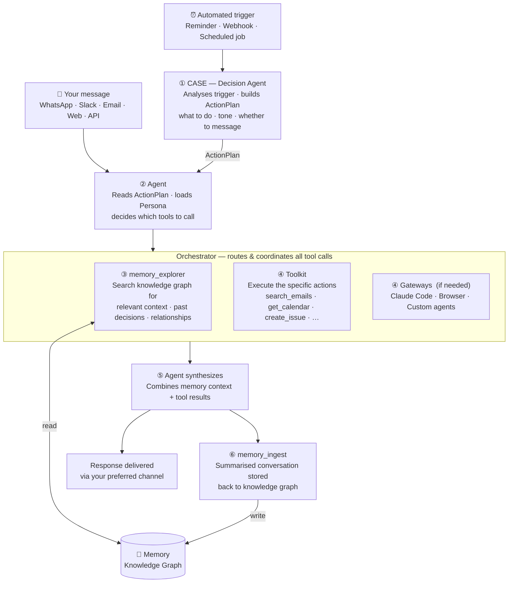

## What is the Agent?

Every butler needs a brain. The Agent is that brain — it's what makes your butler *yours*. It sits between you and everything CORE knows and can do: memory, toolkit, connected apps. When you send a message, it figures out what you need, pulls the right context, takes the right actions, and responds. Every conversation gets ingested back into memory, so your butler gets sharper the more you use it.

You can talk to it from WhatsApp, the web dashboard, email, or through any MCP-compatible agent like Claude Code or Cursor. Same brain, same memory, regardless of where you start.

---

## How It Works

Two paths into CORE — messages from you, and triggers that fire automatically. Both converge on the same intelligence.

### Step by step

When you send a message, here's what happens:

<Steps>
  <Step title="Load Context">
    The agent loads your conversation history and persona document - a living summary of your preferences, directives, expertise, and decisions generated from your memory.
  </Step>

  <Step title="Understand Intent">
    It analyzes your message and decides what's needed: information from memory, live data from apps, web search, or an action to execute.
  </Step>

  <Step title="Gather or Act">
    The agent has two core tools:

    - **gather_context** (READ) — routes to 3 specialized explorers:
      - *Memory Explorer* — searches your knowledge graph for past conversations, decisions, preferences
      - *Integration Explorer* — queries live data from connected apps (emails, calendar, issues)
      - *Web Explorer* — searches the web for real-time information

    - **take_action** (WRITE) — executes actions in your connected apps via the Integration Explorer
  </Step>

  <Step title="Respond and Remember">
    The agent synthesizes results into a response. After responding, the conversation is automatically ingested into your memory graph - building context for future interactions.
  </Step>
</Steps>

---

## It Can Spawn Other Agents

The Agent isn't limited to its own capabilities. It can spin up other agents on your behalf - a Claude Code session to write code, a browser session to research something - all triggered from whatever channel you're on.

You're outside, a production bug comes in. You message the Butler on WhatsApp: "Fix the auth timeout issue in the API." The Butler spins up a Claude Code session on your machine, pulls the relevant context from memory, and starts working on the fix - while you're still on your phone.

---

## Reminders and Scheduled Actions

The agent can execute actions at scheduled times - one-time or recurring. This isn't just "send me a notification." The agent runs the full workflow: searches memory for your rules and preferences, gathers context from connected apps, and takes actions.

**Daily email triage:** Every morning at 10am, the agent wakes up, goes through your inbox, and handles emails based on your email management skills stored in memory - drafting responses, flagging priorities, archiving noise.

**Overnight monitoring:** You tell the agent to watch Sentry while you sleep. A critical error comes in at 3am. The agent evaluates it, spins up a Claude Code session to investigate and fix the issue, then sends you a summary when you wake up.

**Weekly lead research:** Every Monday, the agent researches LinkedIn for leads matching your ICP, compiles them into a Google Sheet with notes, and sends it to your sales channel on Slack - ready for your team's morning standup.

All of this from a single message on WhatsApp: "Every Monday at 9am, find 10 new leads matching our ICP on LinkedIn, add them to the Leads sheet, and share it on #sales in Slack."

---

## How to Access

<CardGroup cols={3}>
  <Card title="Web Dashboard" icon="browser" href="/access-core/channels/web-dashboard">
  </Card>

  <Card title="WhatsApp" icon="whatsapp" href="/access-core/channels/whatsapp">
  </Card>

  <Card title="All Channels" icon="grid" href="/access-core/overview">
    Email, Slack, Telegram, Discord, and more
  </Card>
</CardGroup>

---

## Next Steps

<CardGroup cols={2}>
  <Card title="Memory" icon="database" href="/memory/overview">
    How the knowledge graph stores and organizes your information
  </Card>

  <Card title="Toolkit" icon="wrench" href="/concepts/toolkit">
    How actions work across your connected apps
  </Card>
</CardGroup>
